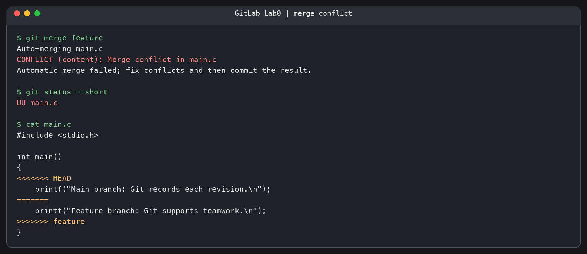
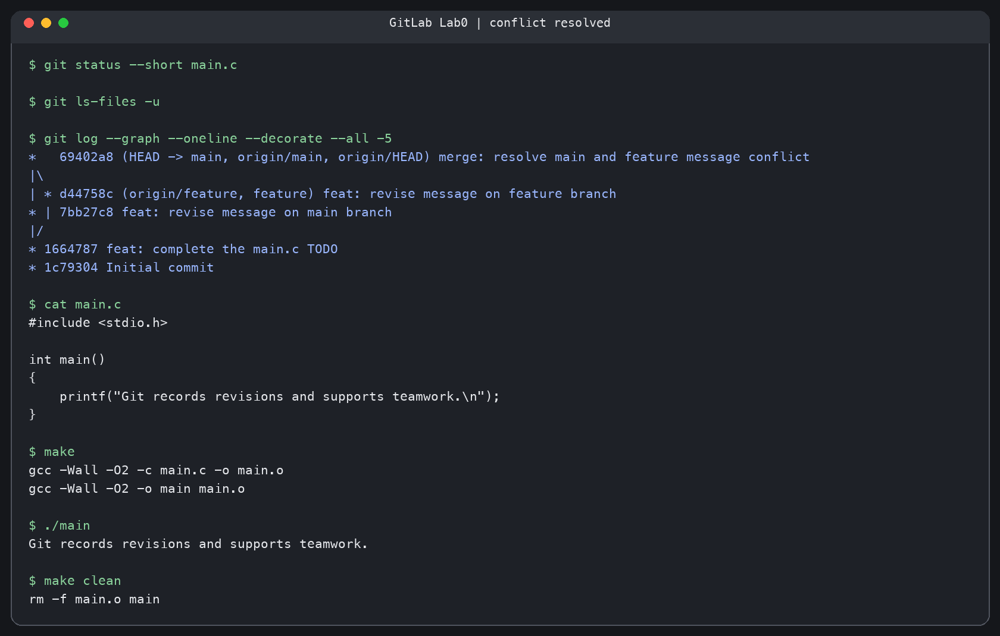

# Lab0：GitLab 实验报告

- 实验日期：2026 年 9 月 28 日
- 个人仓库：<https://github.com/wishhyt/GitLab>
- 实验环境：macOS、Git 2.50.1、`make`、`gcc`

## 一、文档问题

### 1. 多人协同开发经历

我之前有多人协同开发的经历。团队使用 Git 管理代码并进行分工；我负责视觉库功能代码的实现。对我来说，Git 的价值是能保留各人的修改历史，让团队知道某项功能由哪些提交逐步完成。

### 2. 为什么分成“暂存”和“提交”两步？

工作区中的修改不一定都属于同一件事。`git add` 先把本次准备提交的内容选入暂存区，允许我检查差异、排除临时文件，必要时还可以只暂存某个文件的部分修改；`git commit` 再把这组经过选择的内容保存为一个有说明的版本。这样提交可以围绕一个清楚的目的组织，也更便于以后查看和回退。如果工作区一有修改就直接提交，实验代码、临时调试内容和正式功能很容易混在同一次提交里。

### 3. `git branch` 和 `git branch -a` 的区别

不带参数的 `git branch` 列出本地分支，并用 `*` 标明当前分支。`git branch -a` 同时列出本地分支和本地保存的远程跟踪分支，例如本实验中的 `remotes/origin/feature`。远程跟踪分支反映的是上次获取到的远端状态；该命令本身不会联网刷新，若要更新，需要先运行 `git fetch`。这一点与 [Git 官方 `git-branch` 文档](https://git-scm.com/docs/git-branch)一致。

## 二、两篇阅读材料

1. [阮一峰：《Commit message 和 Change log 编写指南》](https://www.ruanyifeng.com/blog/2016/01/commit_message_change_log.html)：文章介绍了结构化的提交说明，常见标题格式为 `type(scope): subject`，正文和页脚可补充动机、影响范围或关联问题。规范的提交说明让人更容易浏览、筛选提交历史，也能为生成更新日志提供基础。本实验的提交说明使用了 `feat:` 等类型前缀。
2. [Semantic Versioning 2.0.0（中文版）](https://semver.org/lang/zh-CN/)：语义化版本采用 `主版本号.次版本号.修订号`。不兼容的公共 API 变化增加主版本号，兼容的新功能增加次版本号，兼容的问题修复增加修订号；规范还定义了先行版本和构建信息。版本号向使用者传达兼容性预期，而 Git 提交记录保留版本之间的具体变化。

**为什么学习 Git：** Git 不只是代码备份工具。它使每次修改都有可追溯的版本，使不同任务能在分支上并行进行，并在合并时指出需要人工判断的冲突。提交说明让开发者读懂“改了什么、为什么改”，语义化版本帮助使用者判断“升级后是否兼容”。这些能力让个人试验和团队协作都更可靠。

## 三、实验步骤与结果

1. 在课程[模板仓库](https://github.com/ICS-26Fall-FDU/GitLab)点击 **Use this template**，建立[个人仓库](https://github.com/wishhyt/GitLab)，然后克隆到本地。
2. 修改 `main.c` 中的 `TODO`，将原先的 `Hello, world!` 改为自选句子，提交为 [`1664787`](https://github.com/wishhyt/GitLab/commit/1664787)。
3. 运行 `git switch -c feature`。在 `feature` 分支修改 `printf` 所在行并提交为 [`d44758c`](https://github.com/wishhyt/GitLab/commit/d44758c)。
4. 切换回 `main`，从共同的起点把**同一行**改成另一句话，提交为 [`7bb27c8`](https://github.com/wishhyt/GitLab/commit/7bb27c8)。
5. 在 `main` 执行 `git merge feature`。Git 输出 `CONFLICT (content): Merge conflict in main.c`，`git status --short` 显示 `UU main.c`。因为两个分支都修改了共同祖先里的同一行，Git 无法自动决定保留哪句话。
6. 手动编辑 `main.c`，删除 `<<<<<<<`、`=======`、`>>>>>>>` 冲突标记，把两边的意思合并为 `Git records revisions and supports teamwork.`；暂存并提交合并结果 [`69402a8`](https://github.com/wishhyt/GitLab/commit/69402a8)。`git ls-files -u` 无输出，说明没有尚未解决的冲突项。
7. 执行 `make`、`./main`、`make clean`。编译成功，程序输出 `Git records revisions and supports teamwork.`。最后把 `main` 和 `feature` 分支都推送到 GitHub。

## 四、冲突现场与解决记录

下图将本次实验保存的真实终端输出排版成图片；原始文本分别保存在 [`conflict-terminal.txt`](evidence/conflict-terminal.txt) 和 [`resolved-terminal.txt`](evidence/resolved-terminal.txt)，可以逐行核对。

**图 1：合并时出现冲突。** `UU main.c` 和冲突标记同时可见。

**图 2：冲突解决后。** 文件中已无冲突标记，提交图显示两个分支汇入同一个 merge commit，编译和运行成功。

## 五、建议

实验文档可以在任务列表旁附一张“完成后检查表”，集中列出 `main.c` 提交、两个分支的提交、冲突解决截图、报告提交和最终仓库链接，便于提交前自查。
